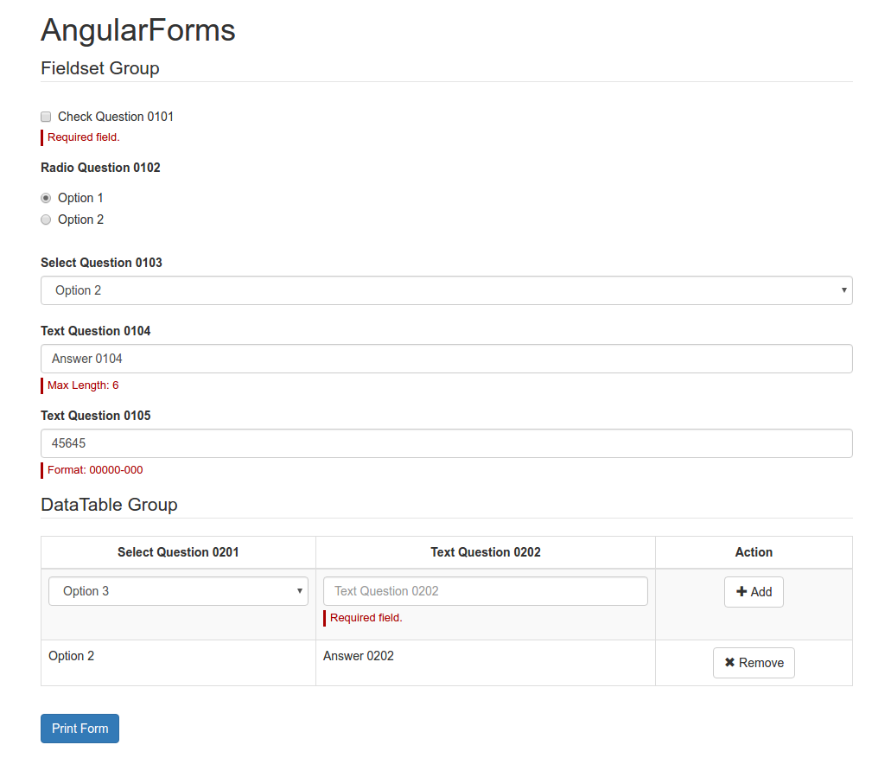
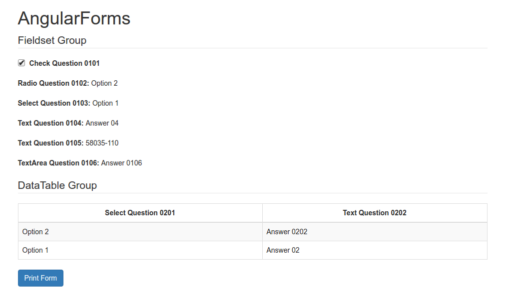

# AngularForms

[](https://travis-ci.org/robust-team/angular-forms)
[](https://codecov.io/gh/robust-team/angular-forms)
[](https://www.codacy.com/app/dudemelo/angular-forms?utm_source=github.com&amp;utm_medium=referral&amp;utm_content=robust-team/angular-forms&amp;utm_campaign=Badge_Grade)
[](http://npmjs.org/package/@robust-team/angular-forms)
[](http://npmjs.org/package/@robust-team/angular-forms)
[](http://issuestats.com/github/robust-team/angular-forms)
[](http://issuestats.com/github/robust-team/angular-forms)

A Simple Form Generator for Angular.

## Requirements

- **@angular/common**: 4.0.0 or higher,
- **@angular/core**: 4.0.0 or higher,
- **@angular/forms**: 4.0.0 or higher,
- **@fagnerlima/ng-mask**: 2.2.1 or higher,
- **@ngx-translate/core**: 7.0.0 or higher,
- **rxjs**: 5.0.1 or higher.

## Usage

1. Install AngularForms using npm:

```
npm i @robust-team/angular-forms
```

2. Import the AngularFormsModule into Module class.

```typescript
import { AngularFormsModule } from '@robust-team/angular-forms';

@NgModule({
  imports: [
    //...
    AngularFormsModule
  ],
  // ...
})
export class MyModule { }
```

3. Insert the AngularFormsComponent into template.

```html
<rb-angular-forms [groups]="customForm"></rb-angular-forms>
```

The **customForm** attribute represents the JSON coming from API. For example:

```json
[
  {
    "code": "G-01",
    "description": "Fieldset Group",
    "type": "group",
    "questions": [
      {
        "name": "Q-0101",
        "description": "Check Question 0101",
        "type": "check",
        "defaultOption": false,
        "validations": [
          { "type": "pattern", "message": "Required field.", "value": "true" }
        ]
      },
      {
        "name": "Q-0102",
        "description": "Radio Question 0102",
        "type": "radio",
        "options": ["Option 1", "Option 2"],
        "defaultOption": "Option 1",
        "validations": [
          { "type": "required", "message": "Required field." }
        ]
      },
      {
        "name": "Q-0103",
        "description": "Select Question 0103",
        "type": "select",
        "options": ["Option 1", "Option 2"],
        "placeholder": "Select",
        "validations": [
          { "type": "required", "message": "Required field." }
        ]
      },
      {
        "name": "Q-0104",
        "description": "Text Question 0104",
        "type": "text",
        "placeholder": "Text Question 0104",
        "validations": [
          { "type": "required", "message": "Required field." },
          { "type": "minlength", "message": "Min Length: 3", "value": 3 },
          { "type": "maxlength", "message": "Max Length: 10", "value": 10 }
        ]
      },
      {
        "name": "Q-0105",
        "description": "Text Question 0105",
        "type": "text",
        "placeholder": "Text Question 0105",
        "validations": [
          { "type": "required", "message": "Required field." },
          { "type": "pattern", "message": "Format: 00000-000", "value": "^\\d{5}-\\d{3}$" }
        ],
        "mask": "00000-000"
      },
      {
        "name": "Q-0106",
        "description": "TextArea Question 0106",
        "type": "textarea",
        "placeholder": "TextArea Question 0106",
        "validations": [
          { "type": "required", "message": "Required field." }
        ],
        "dependencies": [
          { "code": "Q-0103", "criteria": "equals", "expectedAnswer": "Option 1" }
        ]
      }
    ]
  },
  {
    "code": "G-02",
    "description": "DataTable Group",
    "type": "datatable",
    "validations": [
      { "type": "required", "message": "Min number of registers: 1." },
      { "type": "minlength", "message": "Min number of registers: 1.", "value": 1 },
      { "type": "maxlength", "message": "Max number of registers: 3.", "value": 3 }
    ],
    "questions": [
      [
        {
          "name": "Q-0201",
          "description": "Select Question 0201",
          "type": "select",
          "validations": [
            { "type": "required", "message": "Required field." }
          ],
          "options": ["Option 1", "Option 2", "Option 3"],
          "placeholder": "Select"
        },
        {
          "name": "Q-0202",
          "description": "Text Question 0202",
          "type": "text",
          "validations": [
            { "type": "required", "message": "Required field." }
          ],
          "placeholder": "Text Question 0202"
        }
      ],
      [
        {
          "name": "Q-0201",
          "description": "Select Question 0201",
          "type": "select",
          "validations": [
            { "type": "required", "message": "Required field." }
          ],
          "options": ["Option 1", "Option 2", "Option 3"],
          "placeholder": "Select",
          "answer": "Option 2"
        },
        {
          "name": "Q-0202",
          "description": "Text Question 0202",
          "type": "text",
          "validations": [
            { "type": "required", "message": "Required field." }
          ],
          "placeholder": "Text Question 0202",
          "answer": "Answer 0202"
        }
      ]
    ]
  }
]
```



4. Get form values by adding a local variable to the component and calling the **getForm()** method. For example:

```html
<rb-angular-forms #angularForms [groups]="customForm"></rb-angular-forms>
<button (click)="print(angularForms.getForm())">Print Form</button>
```

```typescript
export class MyComponent {

  print(value: any) {
    console.log(value);
  }
}
```

The output of getForm() is an object that contains:

- **valid**: Informs if the forms is valid, that is, if it agrees with all the validations.
- **value**: An object that contains the groups of questions with their respective answers. Groups and questions are represented by their respective code; and each question has its answer.

Example output:

```typescript
{
  valid: false,
  value: {
    "G-01": [
      {
        "Q-101": "Option 1",
        "Q-102": "123"
      }
    ],
    "G-02": {
      "Q-201": "Option 1",
      "Q-202": "Option 2",
      "Q-203": null,
      "Q-204": null
    }
  }
}
```

5. If you want only to show the answers from JSON, use the **readOnly** input with **true** value (your default value is **false**).

```html
<rb-angular-forms #angularForms [groups]="customForm" [readOnly]="true"></rb-angular-forms>
```



6. For you config the language to be used by AngularForms, use the **lang** input. There are two langs available: **en-US** (default) and **pt-BR**.

```html
<rb-angular-forms #angularForms [groups]="customForm" lang="pt-BR"></rb-angular-forms>
```

## Groups

The **Group** represents a grouping of questions, which can be of two types: **Fieldset** and **DataTable**.

### Fieldset

**Fieldset** is a grouping of questions that represents a simple fieldset of HTML. The value of your type is "**group**".

```json
{
  "code": "G-01",
  "description": "Fieldset Group",
  "type": "group",
  "questions": [
    {
      "name": "Q-0101",
      "description": "Check Question 0101",
      "type": "check",
      "validations": []
    },
    {
      "name": "Q-0102",
      "description": "Select Question 0102",
      "type": "select",
      "options": ["Option 1", "Option 2"],
      "validations": []
    }
  ]
}
```

### DataTable

**DataTable** is a grouping of questions that represents a data table, where you add many answers.

```json
{
  "code": "G-01",
  "description": "DataTable Group",
  "type": "datatable",
  "questions": [
    [
      {
        "name": "Q-0101",
        "description": "Check Question 0101",
        "type": "check",
        "validations": []
      },
      {
        "name": "Q-0102",
        "description": "Select Question 0102",
        "type": "select",
        "options": ["Option 1", "Option 2"],
        "validations": []
      }
    ]
  ],
  "validations": []
}
```

## Questions

**Question** represents a simple question, which can be of five types:

- **check**;
- **radio**;
- **select**;
- **text**;
- **textarea**.

### Check

**Check** represents a *checkbox* input from HTML.

```json
{
  "name": "Q-01",
  "description": "Check Question",
  "dependencies": [],
  "type": "check",
  "answer": null,
  "validations": [],
  "defaultOption": false
}
```

### Radio

**Radio** represents a *radio* input from HTML.

```json
{
  "name": "Q-01",
  "description": "Radio Question",
  "dependencies": [],
  "type": "radio",
  "answer": null,
  "validations": [],
  "options": ["Option 1", "Option 2"],
  "defaultOption": null
}
```

### Select

**Select** represents a *select* input from HTML.

```json
{
  "name": "Q-01",
  "description": "Select Question",
  "dependencies": [],
  "type": "select",
  "answer": null,
  "validations": [],
  "options": ["Option 1", "Option 2"],
  "defaultOption": null,
  "placeholder": "Select an option"
}
```

### Text

**Text** represents a *text* input from HTML.

```json
{
  "name": "Q-01",
  "description": "Text Question",
  "dependencies": [],
  "type": "text",
  "answer": null,
  "validations": [],
  "mask": null,
  "placeholder": null
}
```

#### Masks

**Mask** is an attribute of **Text Question** that uses the patterns of the [NgMask](https://fagnerlima.github.io/ng-mask/) library.

```json
{
  "name": "Q-01",
  "description": "Text Question",
  "dependencies": [],
  "type": "text",
  "answer": null,
  "validations": [],
  "mask": "integer(6)",
  "placeholder": null
}
```

Read more in [https://fagnerlima.github.io/ng-mask/](https://fagnerlima.github.io/ng-mask/).

### TextArea

**TextArea** represents a *text* input from HTML.

```json
{
  "name": "Q-01",
  "description": "Text Question",
  "dependencies": [],
  "type": "textarea",
  "answer": null,
  "validations": [],
  "placeholder": null
}
```

## Validations

**Validations** can be used in **Question** and **DataTable**, which can be of seven types:

- **email**;
- **max**;
- **min**;
- **maxlength**;
- **minlength**;
- **pattern**;
- **required**.

### Email

E-mail validation.

```json
{
  "type": "email",
  "message": "Email field."
}
```

### Max

Max value validation for numbers.

```json
{
  "type": "max",
  "message": "Max value: 100.",
  "value": 100
}
```

### Min

Min value validation for numbers.

```json
{
  "type": "min",
  "message": "Min value: 10.",
  "value": 10
}
```

### MaxLength

Max length validation.

```json
{
  "type": "maxlength",
  "message": "Max length: 12.",
  "value": 12
}
```

### MinLength

Min length validation.

```json
{
  "type": "minlength",
  "message": "Min length: 6.",
  "value": 6
}
```

### Pattern

Regular expression validation.

```json
{
  "type": "pattern",
  "message": "Pattern: 00000-000.",
  "value": "^\\d{5}-\\d{3}$"
}
```

### Required

Obligatory field validation. The **requiredTrue** field is used for checkbox validation.

```json
{
  "type": "required",
  "message": "Required field.",
  "requiredTrue": false
}
```

## Dependencies

**Dependencies** are Questions that determine if a Question should be shown or no. The criterias can be of four types:

- **equals**;
- **lessthan**;
- **greaterthan**;
- **notequals**.

```json
{
  "name": "Q-0106",
  "description": "Question TextArea 0106",
  "type": "textarea",
  "placeholder": "Question TextArea 0106",
  "validations": [
    { "type": "required", "message": "Required field." }
  ],
  "dependencies": [
    { "code": "Q-0103", "criteria": "equals", "expectedAnswer": "Option 1" },
    { "code": "Q-0104", "criteria": "greaterthan", "expectedAnswer": "10" }
  ]
}
```
